# Lab 7 — Progressive Delivery: Canary Deployments

## Task 1 — Manual Canary Deployment

### 7.1 — Install Argo Rollouts

Argo Rollouts was installed in the cluster and the local `kubectl-argo-rollouts` plugin was available for rollout operations.

Observed plugin version:

```text
kubectl-argo-rollouts: v1.10.0+d90700a
BuildDate: 2026-08-27T15:22:01Z
GitCommit: d90700ae8d71d141561f0c546e19f999bb335cbd
GitTreeState: clean
GoVersion: go1.26.7
Compiler: gc
Platform: linux/amd64
```

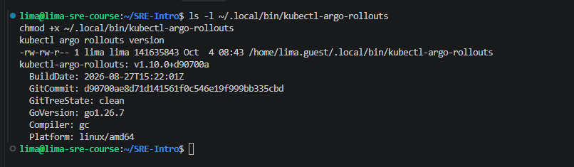

### 7.2 — Convert Gateway Deployment to Rollout

The Gateway manifest was converted from a Kubernetes `Deployment` to an Argo Rollouts `Rollout` in `k8s/gateway.yaml`. The Rollout uses 5 replicas so that 20% canary traffic corresponds to 1 canary pod and 4 stable pods.

The canary strategy configured in the manifest is:

```yaml
strategy:
  canary:
    steps:
      - setWeight: 20
      - pause: {}
      - setWeight: 60
      - pause:
          duration: 30s
      - setWeight: 100
```

After applying the Rollout, the Gateway was healthy with 5 ready and available replicas.

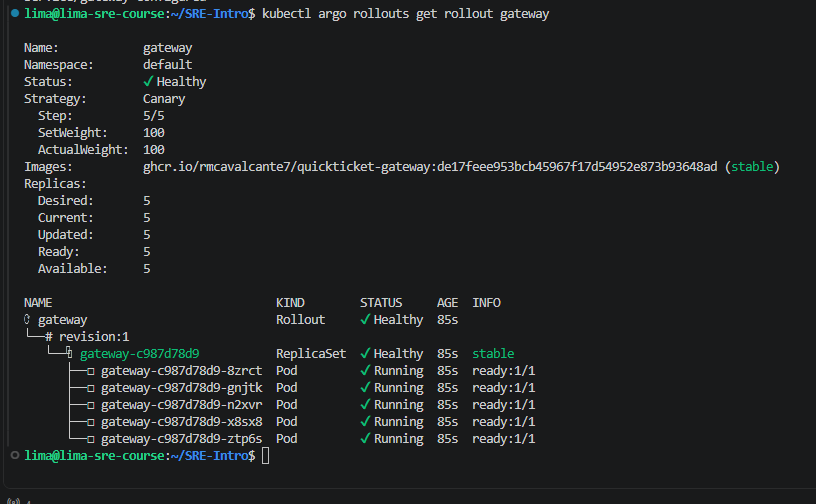

### 7.3 — Deploy a New Version (Canary)

A new Gateway revision was created by changing `APP_VERSION` in the Gateway pod template. Argo Rollouts started a canary and paused at the first manual pause step.

Observed state during the canary:

```text
Status:          Paused
Message:         CanaryPauseStep
Strategy:        Canary
Step:            1/5
SetWeight:       20
ActualWeight:    20
Updated:         1
Ready:           5
Available:       5
```

The output showed `revision:2` as canary with 1 pod and `revision:1` as stable with 4 pods.

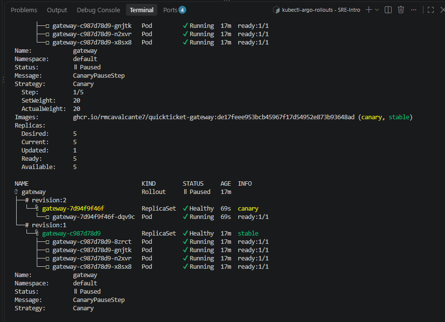

### 7.4 — Verify Traffic Split

The in-cluster load generator was applied from `labs/lab7/loadgen.yaml`. Requests were counted from the Gateway pod logs while the Rollout was paused at 20%.

Observed request counts:

```text
pod/gateway-7d94f9f46f-dqv9c image=ghcr.io/rmcavalcante7/quickticket-gateway:de17feee953bcb45967f17d54952e873b93648ad events_requests=18
pod/gateway-c987d78d9-8zrct image=ghcr.io/rmcavalcante7/quickticket-gateway:de17feee953bcb45967f17d54952e873b93648ad events_requests=11
pod/gateway-c987d78d9-gnjtk image=ghcr.io/rmcavalcante7/quickticket-gateway:de17feee953bcb45967f17d54952e873b93648ad events_requests=16
pod/gateway-c987d78d9-n2xvr image=ghcr.io/rmcavalcante7/quickticket-gateway:de17feee953bcb45967f17d54952e873b93648ad events_requests=25
pod/gateway-c987d78d9-x8sx8 image=ghcr.io/rmcavalcante7/quickticket-gateway:de17feee953bcb45967f17d54952e873b93648ad events_requests=13
```

The canary pod was `gateway-7d94f9f46f-dqv9c`, matching the canary ReplicaSet shown in the Rollout output. The stable pods belonged to ReplicaSet `gateway-c987d78d9`. This confirmed that the Service sent traffic to both canary and stable pods.

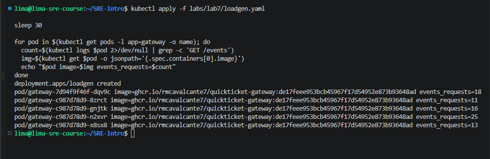

### 7.5 — Promote the Canary

The canary was promoted with:

```bash
kubectl argo rollouts promote gateway
```

After promotion, Argo Rollouts advanced through the 60% step, waited for the configured 30-second pause, and completed the rollout at 100%.

Observed final state after promotion:

```text
Status:    Healthy
revision:2 ReplicaSet Healthy stable
revision:1 ReplicaSet ScaledDown
```

All 5 Gateway pods were running from `revision:2`, which became the stable revision.

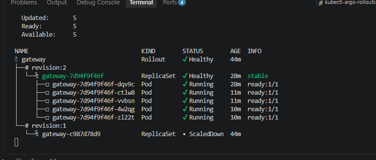

### 7.6 — Deploy a Bad Version and Abort

A new revision was created by changing `APP_VERSION` to `v3-bad`. The Rollout again paused at the 20% canary step.

Observed bad-version canary state:

```text
Status:          Paused
Message:         CanaryPauseStep
Step:            1/5
SetWeight:       20
ActualWeight:    20
revision:3       canary
revision:2       stable
```

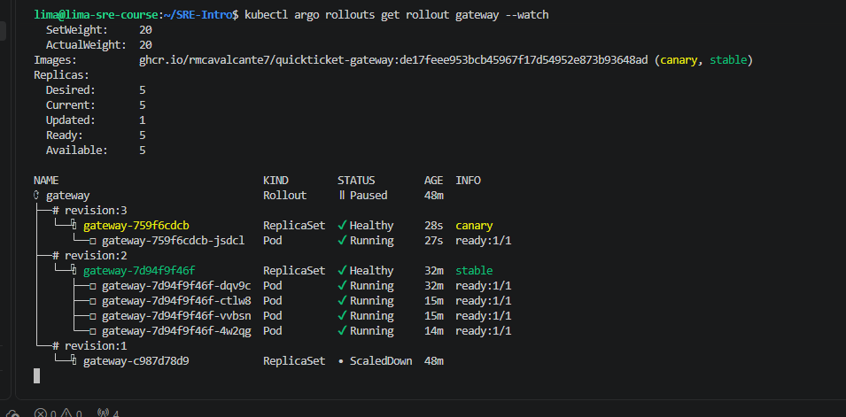

The canary was then aborted with:

```bash
kubectl argo rollouts abort gateway
```

Observed state after abort:

```text
Status:          Degraded
Message:         RolloutAborted: Rollout aborted update to revision 3
SetWeight:       0
ActualWeight:    0
Updated:         0
Ready:           5
Available:       5
revision:3       ScaledDown canary
revision:2       Healthy stable
```

The stable revision continued serving all Gateway traffic with 5 ready pods.

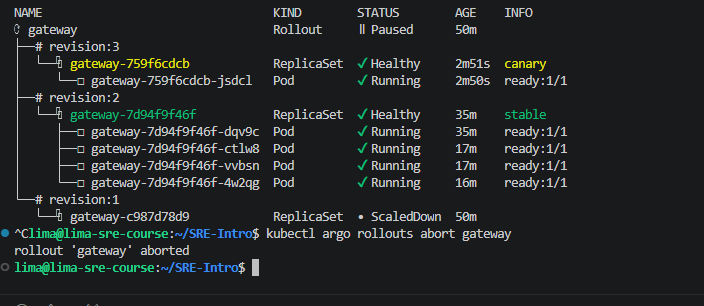

### 7.7 — Proof of Work Answer: Abort vs Git Revert

From `kubectl argo rollouts abort gateway` to all traffic serving the stable version, the rollback was observed in the next Rollout status check. The canary revision was scaled down, `SetWeight` and `ActualWeight` returned to `0`, and the stable revision had 5 ready and available pods. The evidence does not include exact start and end timestamps for the abort, so the measured result is best described as effectively immediate, within the next CLI observation cycle.

This was faster than the Lab 5 GitOps rollback. In Lab 5, the rollback through `git revert` took approximately 34 seconds from revert push to healthy pods. The Argo Rollouts abort was faster because it did not require a new Git commit, CI, Git push, ArgoCD sync, or image redeploy. The Rollouts controller already had both the stable ReplicaSet and the canary ReplicaSet in the cluster, so aborting only shifted traffic back to the existing stable revision and scaled down the canary.

## Task 2 — Multi-Step Canary with Observation

### 7.8 — Design the Multi-Step Canary Strategy

The Gateway Rollout strategy was updated to use smaller canary increments. The new revision was triggered with `APP_VERSION=v5-multistep`.

Configured strategy:

```yaml
strategy:
  canary:
    steps:
      - setWeight: 20
      - pause:
          duration: 60s
      - setWeight: 40
      - pause:
          duration: 60s
      - setWeight: 60
      - pause:
          duration: 60s
      - setWeight: 80
      - pause:
          duration: 30s
      - setWeight: 100
```

With 5 Gateway replicas, the canary steps correspond to 1, 2, 3, 4, and then 5 updated pods.

### 7.9 — Observe the Rollout Steps

The Rollout was observed with:

```bash
kubectl argo rollouts get rollout gateway --watch
```

The captured output shows the multi-step rollout progressing through several canary percentages, including 40%, 60%, 80%, and the final 100% healthy state.

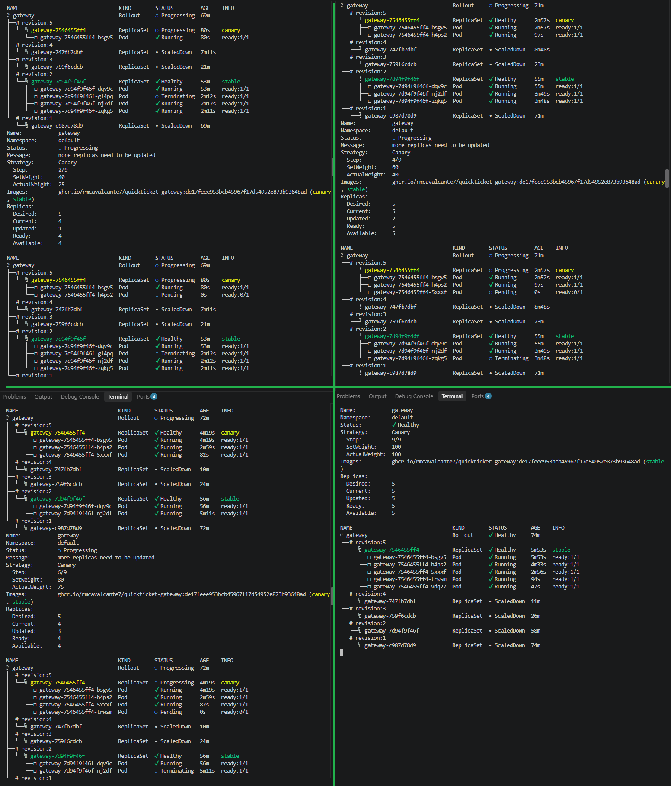

Observed progression:

```text
SetWeight: 40  Updated: 1  ActualWeight: 25
SetWeight: 60  Updated: 2  ActualWeight: 40
SetWeight: 80  Updated: 3  ActualWeight: 75
SetWeight: 100 Updated: 5  ActualWeight: 100 Status: Healthy
```

The actual weight did not always exactly match the configured set weight during intermediate moments because pods were still being created or terminated while the rollout was progressing.

### 7.9 — Observe Traffic During the Rollout

The in-cluster load generator was used during the rollout so the Gateway pods received traffic while the canary progressed.

Observed request counts after the rollout:

```text
pod/gateway-7546455ff4-5xxxf events_requests=151
pod/gateway-7546455ff4-bsgv5 events_requests=225
pod/gateway-7546455ff4-h4ps2 events_requests=177
pod/gateway-7546455ff4-trwsm events_requests=84
pod/gateway-7546455ff4-vdq27 events_requests=93
```

All listed pods belonged to the final updated ReplicaSet, which confirms the rollout completed and the new revision was serving traffic.

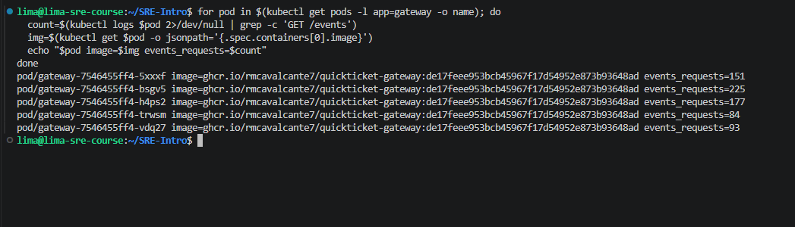

### 7.9 — Automated Abort Threshold Answer

I would want an automated abort as early as 20% if the canary showed elevated errors, failed readiness, or abnormal latency. At 20%, only 1 of 5 Gateway pods is serving the new version, so aborting there limits the blast radius before the issue reaches a larger share of users. If the 20% step stays healthy, I would continue observing at 40% and 60%, but any clear regression should stop the rollout before promotion to majority traffic.

## Bonus Task — Automated Canary Analysis

### B.1 — Install In-Cluster Prometheus and Verify Target Discovery

An in-cluster Prometheus was installed from `labs/lab7/prometheus.yaml`. This Prometheus instance discovers Gateway pods directly inside Kubernetes and copies the Argo Rollouts pod-template hash label into `rs_hash`, which allows the canary analysis to query only the canary ReplicaSet.

Observed targets:

```text
gateway-7546455ff4-trwsm rs= 7546455ff4 up
gateway-7546455ff4-h4ps2 rs= 7546455ff4 up
gateway-7546455ff4-5xxxf rs= 7546455ff4 up
gateway-7546455ff4-bsgv5 rs= 7546455ff4 up
gateway-7546455ff4-vdq27 rs= 7546455ff4 up
```

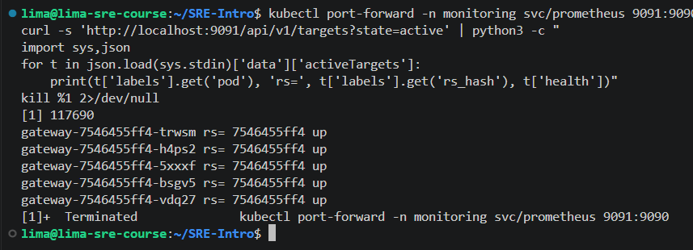

### B.2 — Install the AnalysisTemplate

The `gateway-error-rate` AnalysisTemplate was applied successfully.

```text
NAME                 AGE
gateway-error-rate   19m
```

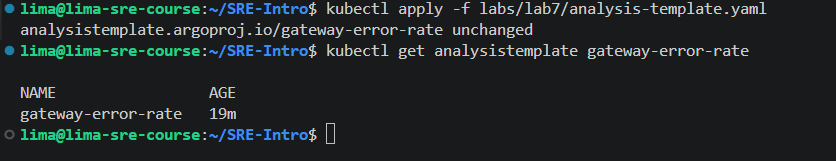

The template measures the 5xx ratio for the canary ReplicaSet by filtering Gateway metrics with the canary `rs_hash`. The success condition is `result[0] < 0.05`, so the canary passes only when the measured error rate is below 5%.

### B.3 — Wire Analysis into the Rollout Strategy

The Gateway Rollout strategy was updated to run `gateway-error-rate` after the first canary exposure. Argo Rollouts passes the latest canary pod-template hash to the AnalysisTemplate, so Prometheus evaluates only the canary ReplicaSet.

Configured analysis step:

```yaml
strategy:
  canary:
    steps:
      - setWeight: 20
      - pause:
          duration: 20s
      - analysis:
          templates:
            - templateName: gateway-error-rate
          args:
            - name: canary-hash
              valueFrom:
                podTemplateHashValue: Latest
      - setWeight: 50
      - pause:
          duration: 20s
      - setWeight: 100
```

### B.4 — Test Good Version Auto-Promotion

A good canary was triggered with the local image `quickticket-gateway:v2`. The rollout completed automatically after the analysis step succeeded.

Observed successful rollout state:

```text
Status:          Healthy
Step:            6/6
SetWeight:       100
ActualWeight:    100
Images:          quickticket-gateway:v2 (stable)
Replicas:
  Desired:       5
  Current:       5
  Updated:       5
  Ready:         5
  Available:     5
AnalysisRun:     gateway-8bc999bd-10-2 Successful, 3 measurements
```

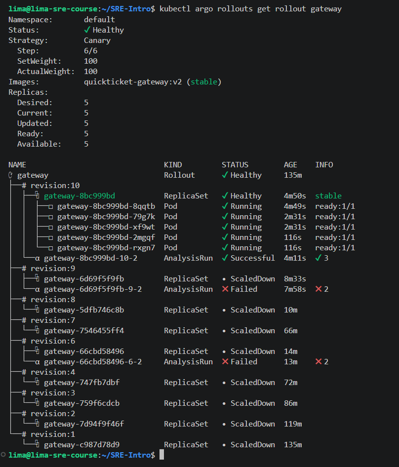

### B.5 — Test Bad Version Auto-Abort

For the bad-canary test, `EVENTS_URL` was temporarily changed to `http://broken-on-purpose:8081` and `GATEWAY_TIMEOUT_MS` to `2000`, so `/events` requests from the canary returned 5xx responses. Argo Rollouts ran the analysis step, detected the high error rate, and aborted the rollout automatically. The stable revision remained serving traffic.

Observed aborted rollout state:

```text
Status:          Degraded
Message:         RolloutAborted: Rollout aborted update to revision 12: Step-based analysis phase error/failed: Metric "error-rate" assessed Failed due to failed (2) > failureLimit (1)
Step:            0/6
SetWeight:       0
ActualWeight:    0
Images:          quickticket-gateway:v2 (stable)
Replicas:
  Desired:       5
  Current:       5
  Updated:       0
  Ready:         5
  Available:     5
AnalysisRun:     gateway-74d4cc445f-12-2 Failed, 2 failed measurements
```

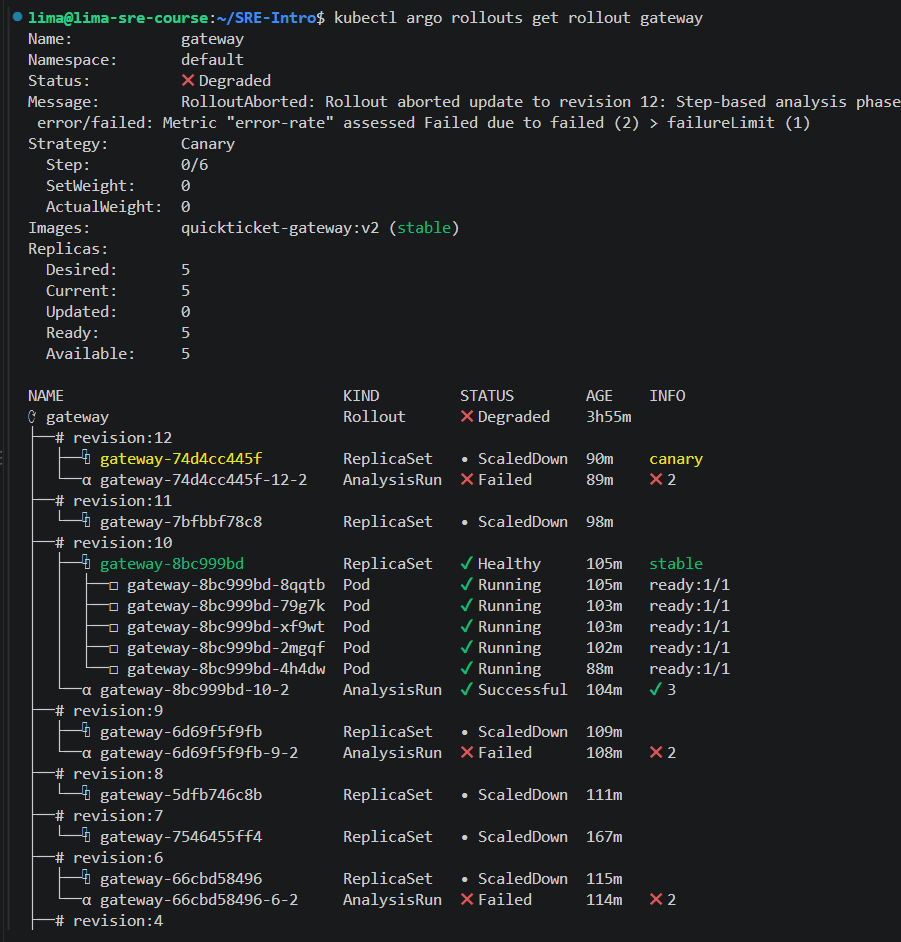

The AnalysisRun list showed both successful and failed analysis executions:

```text
NAME                      STATUS       AGE
gateway-66cbd58496-6-2    Failed       115m
gateway-6d69f5f9fb-9-2    Failed       109m
gateway-74d4cc445f-12-2   Failed       90m
gateway-8bc999bd-10-2     Successful   105m
```

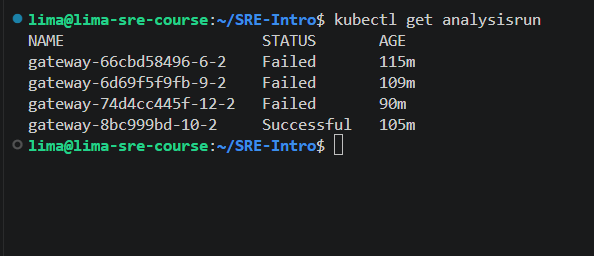

The failed AnalysisRun measured an error rate of `1`, meaning 100% of the measured canary traffic was failing during the analysis windows.

```text
message: Metric "error-rate" assessed Failed due to failed (2) > failureLimit (1)
metricResults:
- count: 2
  failed: 2
  measurements:
  - finishedAt: "2026-10-04T11:21:05Z"
    phase: Failed
    startedAt: "2026-10-04T11:21:05Z"
    value: '[1]'
  - finishedAt: "2026-10-04T11:21:25Z"
    phase: Failed
    startedAt: "2026-10-04T11:21:25Z"
    value: '[1]'
ResolvedPrometheusQuery: |
  (
    sum(rate(gateway_requests_total{rs_hash="74d4cc445f",status=~"5.."}[60s]))
    or on() vector(0)
  )
  /
  sum(rate(gateway_requests_total{rs_hash="74d4cc445f"}[60s]))
```

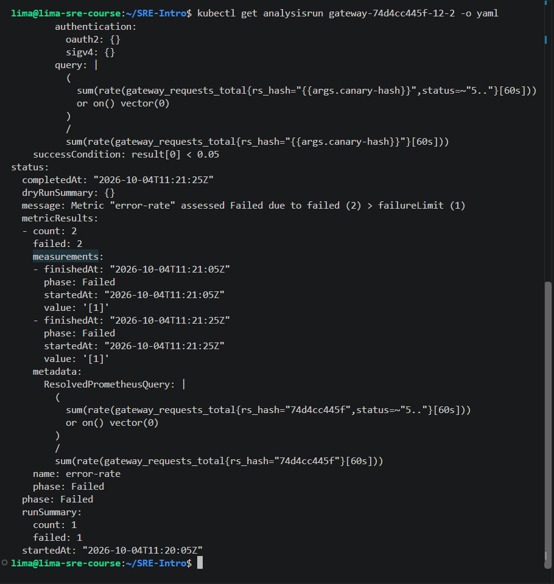

### B.6 — Cleanup and Additional Canary Metric Answer

Beyond error rate, I would add latency, especially p95 or p99 request duration for the canary ReplicaSet. A canary can return HTTP 200 responses and still be unsafe if it is much slower than the stable version. Latency would catch regressions where users experience timeouts or slow checkout flows before the rollout reaches 100%.
