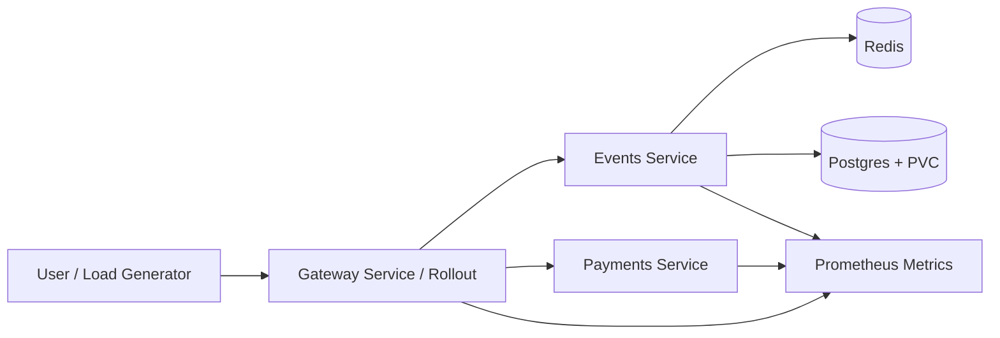

# QuickTicket SRE Handbook

## Architecture



QuickTicket is a small ticketing system running on Kubernetes. The gateway receives user traffic and forwards event listing, reservation, payment, health, and metrics requests to backend services. The events service owns event inventory and order creation. Redis stores short-lived reservation state. Postgres stores durable event and order data. Prometheus scrapes service metrics for golden-signal analysis and alerting.

## How to deploy

1. Commit the application or manifest change to the lab branch.
2. Let CI build and validate the change.
3. Merge the validated work into `main` in the project fork.
4. ArgoCD polls the repository and applies the desired state to the cluster.
5. For gateway changes, Argo Rollouts manages canary progression and AnalysisRuns.
6. Verify rollout health:

```bash
kubectl argo rollouts get rollout gateway
kubectl get pods
kubectl get analysisrun
```

A failed canary should be aborted or rolled back before it reaches 100% traffic.

## Monitoring

Start with the golden signals:

- Traffic: `sum(rate(gateway_requests_total[1m]))`
- Error rate: `sum(rate(gateway_requests_total{status=~"5.."}[1m])) / sum(rate(gateway_requests_total[1m]))`
- Latency: `histogram_quantile(0.99, sum by (le,path) (rate(gateway_request_duration_seconds_bucket[1m])))`
- Saturation: `kubectl top pods` plus DB/Redis connection metrics when available.

Operational checks:

```bash
kubectl get pods
kubectl get rollout gateway
kubectl get analysisrun
kubectl get pods -n monitoring
```

The most important monitoring gap after Lab 10 is database connection-pool visibility for the events service.

## Incident response

1. Confirm the symptom with gateway error rate, latency, and health checks.
2. Identify the affected path: `/events`, `/events/{id}/reserve`, `/reserve/{id}/pay`, or `/health`.
3. Check per-service logs:

```bash
kubectl logs deployment/events --tail=100
kubectl logs deployment/payments --tail=100
kubectl logs -l app=gateway --tail=100 --prefix=true
```

4. Check current Kubernetes state:

```bash
kubectl get pods
kubectl get endpoints gateway
kubectl top pods
```

5. If a canary caused the issue, abort the rollout:

```bash
kubectl argo rollouts abort gateway
```

6. If the issue is stateful data loss or corruption, switch to the backup/restore procedure.
7. Escalate when the incident affects the user-facing checkout path, requires database restore, cannot be mitigated with rollback/abort, or exceeds the agreed SLO/error budget threshold. In the course environment, escalation means notifying the TA/professor with the PR/lab context and the captured evidence; in a production team, it would page the service owner and database owner.
8. Record the timeline, impact, root cause, corrective action, and follow-up prevention work.

## Backup and restore

Postgres data is stored on a PVC after Lab 9, so a normal pod restart should not erase the database. Backups are still required because PVCs do not protect against logical deletion, corruption, or bad migrations.

Create a manual backup:

```bash
kubectl exec -i $(kubectl get pod -l app=postgres -o name) -- \
  pg_dump -U quickticket -d quickticket -Fc > /tmp/quickticket.dump
```

Validate the backup:

```bash
file /tmp/quickticket.dump
kubectl cp /tmp/quickticket.dump <postgres-pod>:/tmp/backup.dump
kubectl exec -i <postgres-pod> -- pg_restore --list /tmp/backup.dump
```

Restore from a custom-format dump:

```bash
kubectl cp /tmp/quickticket.dump <postgres-pod>:/tmp/backup.dump
kubectl exec -i <postgres-pod> -- \
  pg_restore -U quickticket -d quickticket --clean --if-exists /tmp/backup.dump
```

After restore, verify both data and API behavior:

```bash
kubectl exec -i $(kubectl get pod -l app=postgres -o name) -- \
  psql -U quickticket -d quickticket -c 'select count(*) from events; select count(*) from orders;'

kubectl run restore-probe --image=curlimages/curl:latest --rm -i --restart=Never --quiet -- \
  curl -s -o /dev/null -w '%{http_code}\n' http://gateway:8080/events
```
